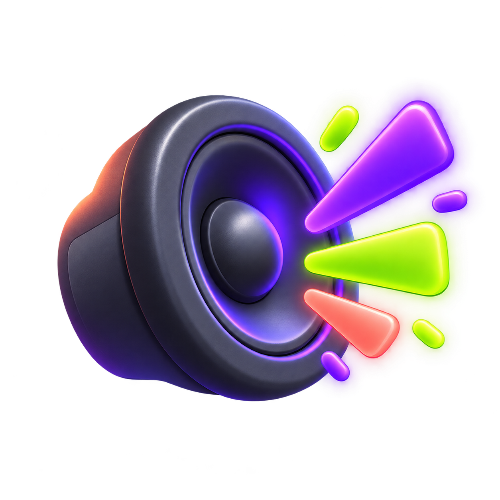

<p align="center">
  
</p>

<h1 align="center">Meme Machine</h1>

<p align="center">
  A local, slap-triggered meme soundboard for Windows, macOS, and Linux.
</p>

<p align="center">
  
  
</p>

<p align="center">
  
  
  
</p>

---

## How It Works

When available, **Meme Machine can use a built-in accelerometer / motion sensor** for more precise slap detection. On devices without sensor support, it automatically falls back to the **microphone detector**.

A slap on the laptop chassis produces a sharp, short impulse that is easy to distinguish from normal audio. The app listens in real time, detects either motion spikes or microphone amplitude spikes above a configurable threshold, and plays a random sound from your selected bundle.

```text
Mic Input -> Amplitude Analysis -> Spike Detection -> Sound Playback
             (cpal)              (threshold + cooldown)    (rodio)
```

- **Ready-to-fill albums** - Trendy, OG, OG-Indian, TV, plus opt-in Moan and Chodu CID albums
- **Pick packs or individual sounds** - build a mix from whole categories or a hand-picked set
- **Random or in-order playback** - choose a shuffle bag or predictable playlist
- **Local-first library** - audio stays on-device in folders you control
- **Opt-in NSFW mode** - mature packs remain locked until deliberately enabled
- **Volume scales with force** - harder slap = louder sound
- **No overlap** - new trigger stops the previous sound
- **Accelerometer mode** - use supported sensor hardware for tighter slap detection
- **Microphone fallback** - works on devices without a motion sensor
- **Port rules** - trigger bundles on charging, USB storage, external display, Ethernet, and dock events
- **Adjustable sensitivity** - tune it for your environment
- **Cooldown timer** - prevent rapid-fire triggers

## Architecture

```text
+-----------------------------------------+
|              System Tray                |
|   Pause/Resume · Test · Settings · Quit |
+--------------+--------------------------+
               |
       +-------v--------+    <- HTML/CSS/JS (Tauri webview)
       |  Settings UI   |
       | (settings.html)|
       +-------+--------+
               | IPC (invoke/emit)
       +-------v--------+
       |   Rust Backend |
       |                |
       |  + Detector +  |    <- Dedicated thread, cpal mic input
       |  | Threshold | |
       |  | Cooldown  | |
       |  | on_slap() | |
       |  +-----+-----+ |
       |        |       |
       |  +-----v-----+ |    <- Dedicated thread, rodio output
       |  |  Player   | |
       |  | Shuffle   | |
       |  | Single    | |
       |  +-----------+ |
       |                |
       |  + Settings +  |    <- Arc<Mutex<Settings>>
       |  | JSON disk | |
       |  +-----------+ |
       +--------+-------+
                |
       +--------v--------+    <- %APPDATA% / ~/Library / ~/.local/share
       |   App Data Dir  |
       |   sounds/       |
       |     Trendy/     |
       |     OG/         |
       |     OG-Indian/  |
       |     TV/         |
       |     Moan/       |
       |     Chodu CID/  |
       |     ...         |
       |   settings.json |
       +-----------------+
```

## Tech Stack

| Layer | Technology |
|-------|-----------|
| Framework | [Tauri v2](https://tauri.app) |
| Backend | Rust |
| Frontend | Vanilla HTML / CSS / JS |
| Audio Input | [cpal](https://crates.io/crates/cpal) |
| Audio Output | [rodio](https://crates.io/crates/rodio) |
| File Dialog | [tauri-plugin-dialog](https://crates.io/crates/tauri-plugin-dialog) |

## Setup

### Prerequisites

- [Node.js](https://nodejs.org) (v18+)
- [Rust](https://rustup.rs) (latest stable)
- [Tauri v2 prerequisites](https://v2.tauri.app/start/prerequisites/)

**Linux only:**
```bash
sudo apt install libwebkit2gtk-4.1-dev libappindicator3-dev librsvg2-dev patchelf libasound2-dev
```

### Development

```bash
git clone https://github.com/adityapatel-00/themoaningguy.git
cd themoaningguy
npm install
npm run dev
```

### Build

```bash
npm run build
```

Produces platform-specific installers in `src-tauri/target/release/bundle/`.

## Usage

1. Launch the app - it sits in your **system tray**
2. Right-click the tray icon -> **Settings**
3. Pick a category card, then add the full pack or select individual sounds
4. Choose **Random** or **In order** playback
5. Optionally unlock the **Moan** and **Chodu CID** albums from the NSFW control
6. Pick **Accelerometer** or **Microphone** mode when available
7. Adjust **sensitivity**, **cooldown**, and **volume**; every change applies immediately

You can also create custom collections and import `wav`, `mp3`, `ogg`, or `flac` files locally.

## Safety & Limitations

- Detection is best-effort and may produce false positives or miss some events.
- Port detection depends on what the operating system exposes on the current device.
- Microphone mode uses the active input device while the app is running.
- Accelerometer mode, when available, depends on supported sensor hardware and drivers.
- Background monitoring uses some CPU and battery, especially in microphone mode.
- Use the app responsibly on sensitive, shared, or production machines.

## Disclaimer

This software is provided "as is", without warranty of any kind. The author is not responsible for any damage, data loss, hardware issues, or unintended behavior that may result from using the app.

## Sound Library

On macOS, the app creates these empty folders on first launch: `~/Library/Application Support/com.mememachine.desktop/sounds/Trendy`, `OG`, `OG-Indian`, `TV`, `Moan`, and `Chodu CID`.

Drop audio directly into the matching folder, or select a pack in the app and use **Details → Add Sounds…**. Supported formats are `wav`, `mp3`, `ogg`, and `flac`; your library persists across updates.

## Project Site

The GitHub Pages landing page lives in [docs/index.html](docs/index.html). Enable GitHub Pages from the repo `docs/` folder to publish it.

## Platform Notes

| Platform | Tray Icon | Notes |
|----------|-----------|-------|
| **Windows** | Works out of the box | Appears in system tray |
| **macOS** | Works out of the box | Appears in menu bar. You may need to grant **Microphone** permission in System Settings -> Privacy & Security |
| **Linux** | Usually works | If the tray icon does not appear on GNOME, install the [AppIndicator extension](https://extensions.gnome.org/extension/615/appindicator-support/) |

## License

MIT
